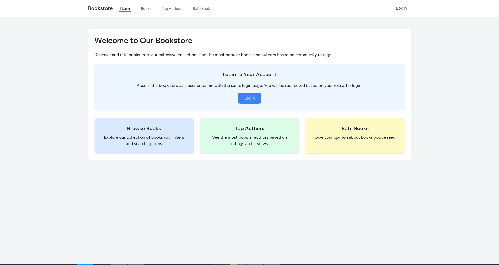
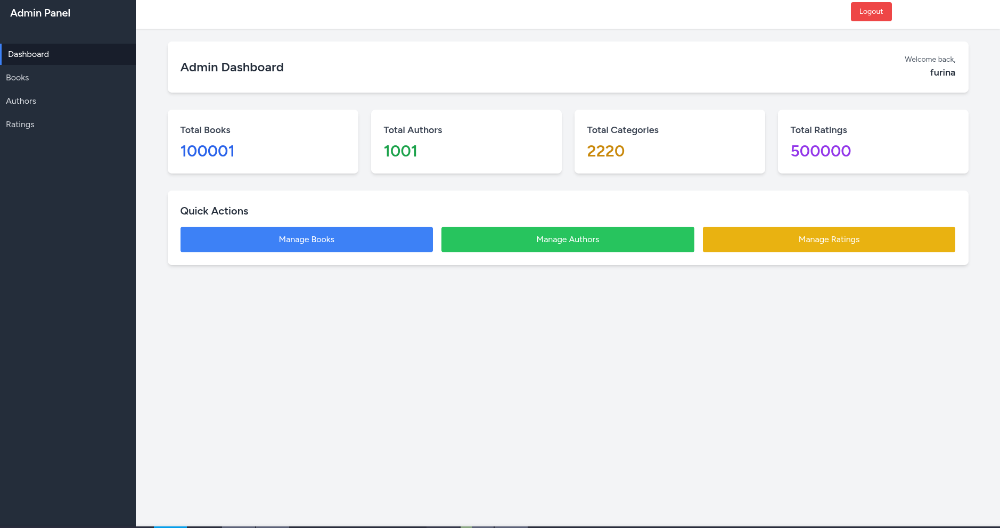

# 📚 Bookstore Management System

Sistem manajemen toko buku berbasis web yang dibangun dengan Laravel 10.49, dilengkapi dengan fitur-fitur canggih untuk pengelolaan katalog buku, database penulis, dan sistem rating interaktif.

[English Version / Versi Inggris](README_EN.md)

## ✨ Fitur Unggulan

- 📖 **Katalog Buku Lengkap** - Menampilkan ribuan buku dengan sistem pencarian dan filter multi-kriteria
- 🏆 **Leaderboard Penulis** - Peringkat penulis berdasarkan popularitas, rating rata-rata, dan tren terkini
- ⭐ **Sistem Rating Dinamis** - Penilaian buku dengan skala 1-10 dan cooldown 24 jam per pengguna
- 🔐 **Panel Admin Terintegrasi** - Dashboard lengkap untuk manajemen buku, penulis, dan moderasi rating
- ⚡ **Performa Optimal** - Dirancang untuk menangani dataset besar (100.000+ buku, 500.000+ rating)

## 📑 Daftar Isi

- [Tampilan Aplikasi](#-tampilan-aplikasi)
- [Struktur Routing](#-struktur-routing)
- [Instalasi](#-instalasi)
- [Konfigurasi](#-konfigurasi)
- [Database Seeding](#-database-seeding)
- [Panduan Penggunaan](#-panduan-penggunaan)
- [Keamanan](#-keamanan)
- [Teknologi](#-teknologi)

## 🖼️ Tampilan Aplikasi

### Tampilan User

- **Beranda** - Landing page dengan highlights dan navigasi utama
- **Katalog Buku** - Grid/list view dengan filter dan sorting advanced
- **Detail Buku** - Informasi lengkap buku, statistik rating, dan form penilaian
- **Top Authors** - Leaderboard penulis dengan berbagai metrik performa
- **Form Rating** - Interface interaktif untuk memberikan penilaian (memerlukan login)

### Tampilan Admin

- **Dashboard** - Overview statistik aplikasi dan activity logs
- **Manajemen Buku** - CRUD operations dengan bulk actions
- **Manajemen Penulis** - Database penulis dengan profile lengkap
- **Moderasi Rating** - Review dan hapus rating yang tidak sesuai

## 🛣️ Struktur Routing

### Rute Publik (Tanpa Autentikasi)

```
GET  /                      → Redirect ke halaman home
GET  /home                  → Halaman beranda aplikasi
GET  /books                 → Katalog buku dengan filter
GET  /books/{id}            → Detail buku spesifik
GET  /authors               → Leaderboard penulis teratas
GET  /login                 → Halaman login (user & admin)
GET  /register              → Halaman registrasi user baru
```

### Rute User (Memerlukan Autentikasi)

```
GET     /dashboard          → Dashboard user
GET     /profile            → Halaman profil user
PATCH   /profile            → Update data profil
DELETE  /profile            → Hapus akun user
GET     /ratings/create     → Form penilaian buku
```

### Rute Admin (Memerlukan Role Admin)

```
# Dashboard
GET  /admin/dashboard       → Dashboard admin dengan statistik

# Manajemen Buku
GET     /admin/books                → List semua buku
GET     /admin/books/create         → Form tambah buku
POST    /admin/books                → Simpan buku baru
GET     /admin/books/{book}/edit    → Form edit buku
PUT     /admin/books/{book}         → Update buku
DELETE  /admin/books/{book}         → Hapus buku

# Manajemen Penulis
GET     /admin/authors                  → List semua penulis
GET     /admin/authors/create           → Form tambah penulis
POST    /admin/authors                  → Simpan penulis baru
GET     /admin/authors/{author}/edit    → Form edit penulis
PUT     /admin/authors/{author}         → Update penulis
DELETE  /admin/authors/{author}         → Hapus penulis

# Manajemen Rating
GET     /admin/ratings              → List semua rating
DELETE  /admin/ratings/{rating}     → Hapus rating
```

### API Endpoints

```
GET   /api/books                  → Daftar buku (JSON)
GET   /api/authors                → Daftar penulis (JSON)
POST  /api/ratings                → Submit rating baru
POST  /api/books/{bookId}/rate    → Rate buku tertentu
GET   /api/categories             → Daftar kategori (JSON)
```

## 📦 Instalasi

### Persyaratan Sistem

- PHP 8.1 atau lebih tinggi
- Composer 2.x
- Database (MySQL 8.0+ / PostgreSQL 13+ / SQLite 3.35+)
- Node.js 16+ & npm
- Extension PHP: BCMath, Ctype, JSON, Mbstring, OpenSSL, PDO, Tokenizer, XML

### Langkah Instalasi

**1. Clone Repository**
```bash
git clone <repository-url>
cd bookstore
```

**2. Install Dependencies Backend**
```bash
composer install
```

**3. Install Dependencies Frontend**
```bash
npm install
```

**4. Setup Environment File**
```bash
cp .env.example .env
```

**5. Generate Application Key**
```bash
php artisan key:generate
```

**6. Konfigurasi Database**

Edit file `.env` dan sesuaikan dengan database Anda:

```env
DB_CONNECTION=mysql
DB_HOST=127.0.0.1
DB_PORT=3306
DB_DATABASE=bookstore
DB_USERNAME=root
DB_PASSWORD=
```

**7. Jalankan Database Migration**
```bash
php artisan migrate
```

**8. (Opsional) Seed Data Dummy**
```bash
php -d memory_limit=2G artisan db:seed
```

**9. Compile Assets Frontend**
```bash
# Development
npm run dev

# Production
npm run build
```

**10. Jalankan Development Server**
```bash
php artisan serve
```

Aplikasi akan berjalan di `http://localhost:8000`

## ⚙️ Konfigurasi

### Membuat Admin User

Gunakan Laravel Tinker untuk membuat user admin:

```bash
php artisan tinker
```

Kemudian jalankan:

```php
App\Models\User::create([
    'name' => 'Administrator',
    'email' => 'admin@bookstore.com',
    'password' => bcrypt('admin123'),
    'is_admin' => true,
    'email_verified_at' => now(),
]);
```

### Storage Link (Untuk Upload Gambar)

```bash
php artisan storage:link
```

### Optimasi Cache (Production)

```bash
php artisan config:cache
php artisan route:cache
php artisan view:cache
```

## 🌱 Database Seeding

Aplikasi menyediakan seeder untuk generate data dummy dalam jumlah besar.

### Command Seeding

```bash
# Dengan alokasi memory 2GB
php -d memory_limit=2G artisan db:seed

# Atau seeder spesifik
php artisan db:seed --class=AuthorSeeder
php artisan db:seed --class=BookSeeder
php artisan db:seed --class=RatingSeeder
```

### Data yang Di-generate

| Model | Jumlah | Keterangan |
|-------|--------|------------|
| Authors | 1,000 | Penulis dengan bio lengkap |
| Categories | 3,000 | Kategori buku yang beragam |
| Books | 100,000 | Buku dengan relasi ke penulis & kategori |
| Ratings | 500,000 | Rating user ke buku (1-10) |

### ⚠️ Catatan Penting Seeding

- **RAM Minimum**: 2GB (gunakan flag `-d memory_limit=2G`)
- **Waktu Proses**: 10-20 menit tergantung spesifikasi hardware
- **Disk Space**: ~500MB untuk database SQLite, lebih sedikit untuk MySQL/PostgreSQL
- Seeding akan membuat statistik agregat otomatis (book_statistics, author_statistics)

## 📖 Panduan Penggunaan

### Untuk Pengunjung (Guest)

1. **Jelajahi Katalog Buku**
   - Akses `/books` untuk melihat semua buku
   - Gunakan search bar untuk pencarian by title, author, ISBN, atau publisher
   - Filter berdasarkan penulis, tahun terbit, atau kategori
   - Sort berdasarkan rating, popularitas, atau alfabetis

2. **Lihat Detail Buku**
   - Klik card buku untuk melihat informasi lengkap
   - Lihat statistik rating dan trend popularity
   - Baca deskripsi dan informasi publikasi

3. **Eksplorasi Penulis**
   - Kunjungi `/authors` untuk melihat leaderboard
   - Filter berdasarkan Most Popular, Highest Rated, atau Trending
   - Klik penulis untuk lihat semua bukunya

### Untuk User Terdaftar

1. **Registrasi/Login**
   - Buat akun di `/register`
   - Login via `/login`

2. **Memberikan Rating**
   - Akses `/ratings/create` atau klik tombol "Rate This Book"
   - Pilih buku dari dropdown (auto-complete)
   - Berikan rating 1-10 menggunakan star selector
   - Submit (cooldown 24 jam per buku)

3. **Kelola Profil**
   - Edit informasi profil di `/profile`
   - Ubah password
   - Hapus akun jika diperlukan

### Untuk Admin

1. **Akses Panel Admin**
   - Login dengan akun admin
   - Otomatis redirect ke `/admin/dashboard`

2. **Manajemen Buku**
   - Tambah buku baru dengan form lengkap
   - Edit informasi buku existing
   - Hapus buku (soft delete)
   - Assign multiple categories
   - Upload cover image (coming soon)

3. **Manajemen Penulis**
   - CRUD operations pada database penulis
   - Edit bio dan informasi kontak
   - Lihat statistik performa

4. **Moderasi Rating**
   - Review semua rating yang masuk
   - Hapus rating spam atau tidak pantas
   - Filter berdasarkan user atau buku

## 🔒 Keamanan

### Autentikasi & Otorisasi

- **Laravel Breeze** untuk scaffolding auth
- **Middleware Protection** pada semua rute sensitif
- **Role-based Access Control** (RBAC) via `is_admin` flag
- **CSRF Protection** otomatis pada semua form POST/PUT/DELETE

### Validasi Input

- Server-side validation pada semua form submission
- **Rate Limiting** pada API endpoints (60 requests/menit)
- **SQL Injection Protection** via Eloquent ORM
- **XSS Prevention** via Blade templating auto-escape

### Best Practices

- Password di-hash menggunakan bcrypt
- Session management dengan secure cookies
- Environment variables untuk credentials
- Regular security updates via Composer

## 🛠️ Teknologi

### Backend Stack

- **Framework**: Laravel 10.49 (PHP 8.1+)
- **Database**: MySQL 8.0 / PostgreSQL / SQLite
- **ORM**: Eloquent
- **Authentication**: Laravel Breeze
- **API**: RESTful with JSON responses

### Frontend Stack

- **Templating**: Blade Templates
- **CSS Framework**: Tailwind CSS 3.x
- **JavaScript**: Alpine.js 3.x (reactive components)
- **Build Tool**: Vite
- **Icons**: Heroicons / Lucide Icons

### Database Schema

```
📊 Core Tables:
- users (pengguna & admin)
- authors (penulis buku)
- categories (kategori buku)
- books (katalog buku)
- book_category (pivot table)
- ratings (penilaian user)

📈 Statistics Tables:
- book_statistics (agregat rating per buku)
- author_statistics (agregat performa penulis)
```

### Package Dependencies

**Backend:**
- laravel/framework ^10.10
- laravel/breeze ^1.29
- doctrine/dbal (untuk migrations)

**Frontend:**
- alpinejs ^3.13
- tailwindcss ^3.4
- @tailwindcss/forms

